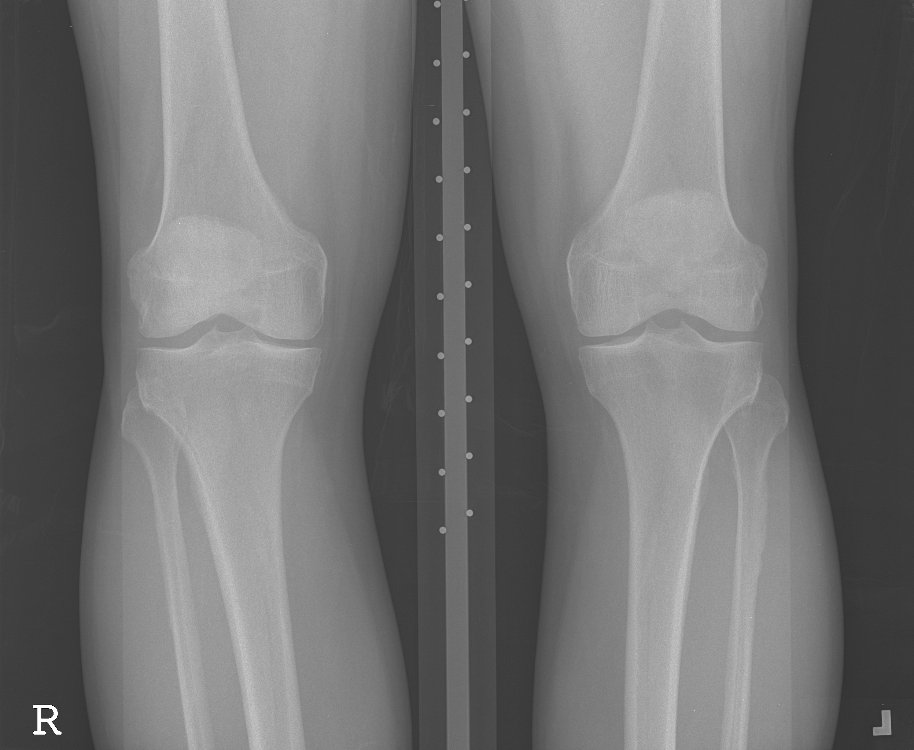
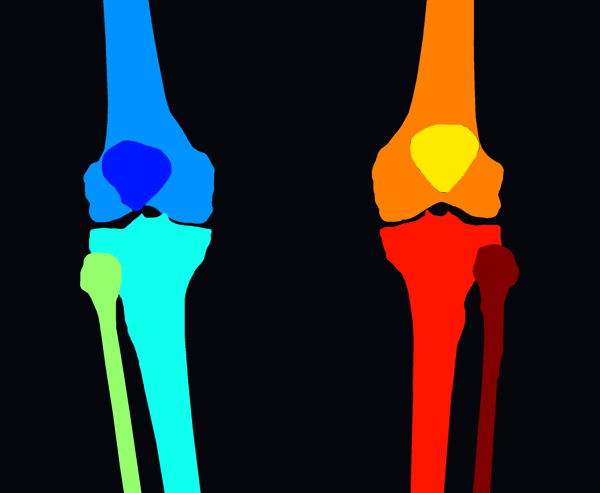

# Project #1 [Sample Project]
## Fair and Explainable Knee Bony Anatomy Segmentation
### Problem Statement
Automatic segmentation of the knee bony anatomy is vital in orthopedics for precise information about the overall structure of the knee joint. It aids with pre-operative planning, post-operative evaluation, knee alignment analysis, and disease progression analysis, among many others. In this project, you need to design and develop a fair (unbiased in sex and race) and explainable deep learning pipeline to tackle the problem of the knee bony anatomy in plain radiographs. 

### Dataset 
The dataset for this challenge can be downloaded from [this link](https://drive.google.com/file/d/1OMkD6_NMlBdgTbamB09wREn3qpuA36ew/view). Inside you will find two folders:
- Images/ : Directroy containing DICOM files containing individual knee x-rays.
- Annotations/ : Directory containing manually annotated segmentation masks for the knee.
- knee_seg_samples.csv : CSV containing patient ids and related demographic information

#### Knee Bony Anatomy Classes

| Class | Label      |
|-------|------------|
| 0     | Background |
| 1     | R Patella  |
| 2     | R Femur    |
| 3     | R Tibia    |
| 4     | R Fibula   |
| 5     | L Patella  |
| 6     | L Femur    |
| 7     | L Tibia    |
| 8     | L Fibula   |

### Computational Tasks
1. Generate a training, validation, and test set for this dataset.
2. Train a deep learning segmentation model using PyTorch, while the model is accurate, unbiased, and also explainable.
3. Compute the Intersection over Union (IoU) and Dice Score for each bony anatomy and provide individual averages for each class.
4. Provide an image containing the original image, the annotated segmentation mask, and the predicted mask for 5 examples.
5. Once you are done with all these steps, then please upload your code and results to this repo. 

## PowerPoint Presentation and Data Analysis

Your slides and data analysis should include the followings:

1. First you start with analyzing the existing datasets and you find out there are two main challenges in the project:
   
   a. You have few labeled images. What is your possible solutions in this situation?
   
   b. Fairnees (unbiased segmentation in respect to sex and race. 
3. After that you should suggest a model, what is/are your suggestions? 
4. Let's say you choose a model and compared to the baseline the accuracy of your model is higher. Please analyze your results.
5. Finally, you are using a model and the model is detecting the whole image as background. What is/are the possible reason/s? What are your solutions?

   
